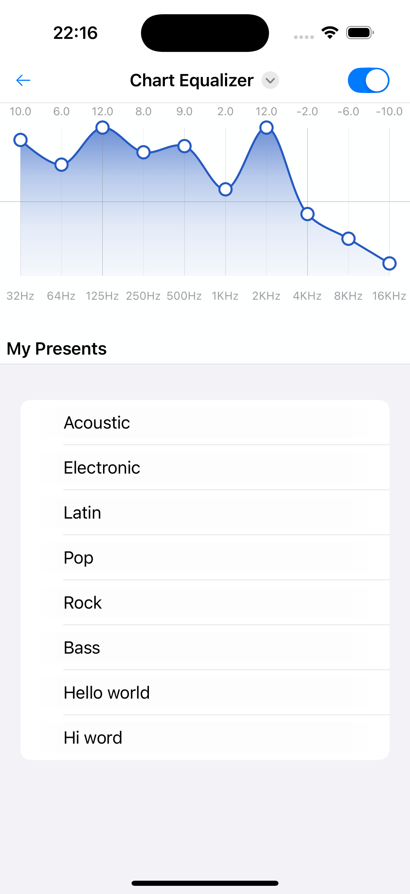

# swiftui equalizer 🌟🌟🌟🌟🌟

> If you find this project helpful, please consider giving it a ⭐ on GitHub! Your support means a lot and helps the project grow. Thank you! 🌟

**swiftui-ext-toastify** is a SwiftUI extension for easily displaying toast notifications with customizable appearance, multiple toast types (success, error, warning, etc.), and simple integration. Built upon [swiftui-toasts](https://github.dev/sunghyun-k/swiftui-toasts).

---

## Features

- Show toast notifications in any SwiftUI view
- Support for various toast types: success, error, warning, custom, etc.
- Customizable icon, message, button, duration, and position (top or bottom)
- Simple, flexible API for integration

---

## Preview

---
